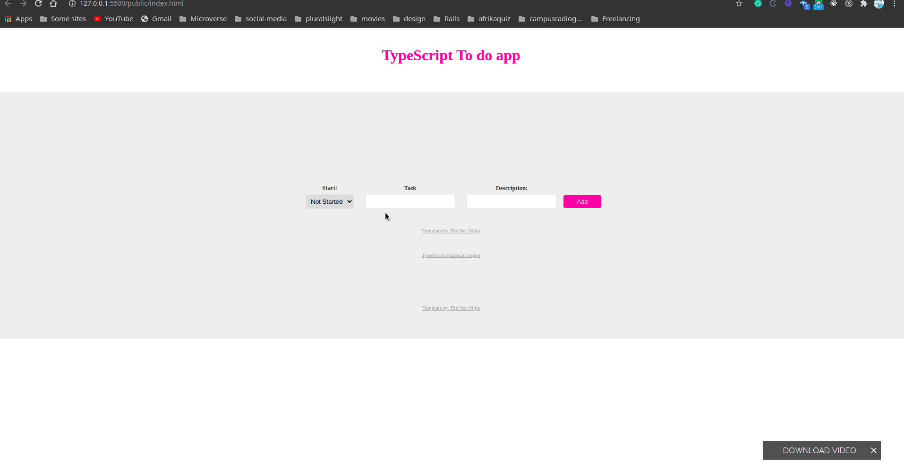

# Webpack-TypeScript
A webpack and TypeScript Todo application

- It uses localStorage to store Todos
- Responsive
- Users can create Todos
- Users can edit Todos
- Users can delete Todos

#  Screenshot

# Live Demo
[Live Demo Link](https://rawcdn.githack.com/kelibst/Webpack-TypeScript/9c314c3ae19761d7cba6ff0116d4fb33ad1b600a/public/index.html)

# Built With

- JavaScript
- WebPack
- HTML5
- CSS3

# usage
visit live [link](https://rawcdn.githack.com/kelibst/Webpack-TypeScript/9c314c3ae19761d7cba6ff0116d4fb33ad1b600a/public/index.html) in your browser.

## Authors

👤 **Kelly Booster**

- Github: [@kelibst](https://github.com/kelibst)
- Twitter: [@keli_booster](https://twitter.com/keli_booster)
- Linkedin: [Kekeli (Jiresse) Dogbevi
](https://www.linkedin.com/in/kekeli-dogbevi-jiresse/)

# 🤝 Contributing
Contributions, issues and feature requests are welcome!

Design inspiration from [Kirill Zhukovsky](https://dribbble.com/shots/9713186-To-Do-Dashboard/attachments/1743028?mode=media)

Feel free to check the issues page

# Show your support
Give a ⭐️ if you like this project!

This project is [MIT](lic.url) licensed.